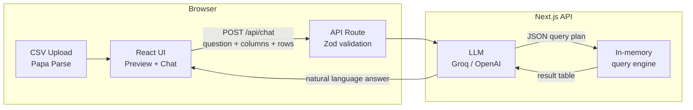

# GenAI Data Chat

**Natural language Q&A over uploaded CSVs** — upload a spreadsheet, ask questions in plain English, and get grounded answers with the query used and a result table.

| | |
|---|---|
| **Live demo** | [https://singareddyai.com](https://singareddyai.com) · [https://genai-data-chat.vercel.app](https://genai-data-chat.vercel.app) |
| **Repository** | [https://github.com/Vekri/GenAI-Data-Chat](https://github.com/Vekri/GenAI-Data-Chat) |
| **Brand / icon** | **GenAI Data Chat** on [Singareddy AI](https://singareddyai.com) |
| **Type** | Full-stack web app (frontend + API in one Next.js project) |

---

## What this project does

1. User uploads a CSV (or loads a sample sales dataset).
2. The browser parses the file and infers column types (`string`, `number`, `boolean`, `date`).
3. User asks a question in natural language (e.g. *“Which region had the highest revenue?”*).
4. The API sends the schema + sample rows to an LLM (Groq or OpenAI).
5. The model returns a **structured query plan** (not free-form code).
6. A safe in-memory engine runs filter / group / aggregate on the uploaded rows.
7. The LLM writes a short natural-language answer from the real result rows.
8. The UI shows the answer, the query description, and a result preview.

This is a classic **RAG-style analytics pattern** for tabular data: the model plans the analysis; your code executes it on real data so numbers stay grounded.

---

## Features

- Drag-and-drop CSV upload (up to 20,000 rows)
- Automatic column type inference + data preview
- Chat UI with suggested starter questions
- LLM-powered query planning + answer summarization
- Safe deterministic query execution (no arbitrary code from the model)
- Free-tier friendly via **Groq**; optional **OpenAI**
- Deployed on **Vercel**

---

## Architecture



### Request flow (step by step)

| Step | Where | What happens |
|------|--------|----------------|
| 1 | Browser | `papaparse` reads the CSV into row objects |
| 2 | `src/lib/csv.ts` | Infers types and coerces values (numbers, booleans, nulls) |
| 3 | `ChatPanel` | Sends `{ question, datasetName, columns, rows }` to `/api/chat` |
| 4 | `api/chat/route.ts` | Validates payload with **Zod** |
| 5 | `lib/chat.ts` | Calls LLM to produce a JSON **query plan** |
| 6 | `lib/query.ts` | Executes plan: `where` → `groupBy` → aggregates → `orderBy` → `limit` |
| 7 | `lib/chat.ts` | Calls LLM again to summarize the result table |
| 8 | UI | Renders answer + query text + result table |

**Important design choice:** the LLM never runs SQL or JavaScript against your data directly. It only outputs a JSON plan that our executor understands. That reduces injection risk and keeps answers tied to computed results.

---

## Technologies used (detailed)

### Frontend & app framework

| Technology | Version / role | Why it is used |
|------------|----------------|----------------|
| **[Next.js](https://nextjs.org/)** (App Router) | 16.x | React framework with file-based routing, API routes, and easy Vercel deploy. One codebase for UI + backend. |
| **[React](https://react.dev/)** | 19.x | Component UI: uploader, preview, chat messages, forms. |
| **[TypeScript](https://www.typescriptlang.org/)** | 5.x | Typed props, API payloads, and query plans — safer refactors and clearer docs for teammates. |
| **[Tailwind CSS](https://tailwindcss.com/)** | 4.x | Utility-first styling for a custom dark “data lab” UI without a large CSS codebase. |
| **Google Fonts via `next/font`** | Sora, Manrope, IBM Plex Mono | Display / body / monospace fonts loaded optimally by Next.js. |

### Data ingestion

| Technology | Why it is used |
|------------|----------------|
| **[Papa Parse](https://www.papaparse.com/)** | Fast, reliable CSV parsing in the browser (headers, empty-line handling). Keeps parsing on the client so the server only receives structured JSON. |

### AI / LLM layer

| Technology | Why it is used |
|------------|----------------|
| **[OpenAI Node SDK](https://github.com/openai/openai-node)** | Single client for chat completions. Works with OpenAI *and* any OpenAI-compatible API. |
| **[Groq](https://console.groq.com/)** (default) | Free-tier LLM inference (no credit card). OpenAI-compatible base URL: `https://api.groq.com/openai/v1`. Default model: `llama-3.3-70b-versatile`. |
| **OpenAI API** (optional) | Alternative if you set `OPENAI_API_KEY` instead of Groq. Default model: `gpt-4o-mini`. |
| **JSON mode** (`response_format: json_object`) | Forces the model to return structured JSON for the query plan. |
| **Two-pass prompting** | (1) Plan the analysis (2) Summarize results — separates “how to compute” from “how to explain”. |

### Validation & query execution

| Technology | Why it is used |
|------------|----------------|
| **[Zod](https://zod.dev/)** | Runtime validation of API request bodies and LLM query plans. Rejects malformed input before execution. |
| **Custom in-memory query engine** (`src/lib/query.ts`) | Executes plans: filters, group-by, count/sum/avg/min/max, sort, limit. No native DB binary, no SQL injection surface from the model. |

### Hosting & tooling

| Technology | Why it is used |
|------------|----------------|
| **[Vercel](https://vercel.com/)** | Hosts the Next.js app; serverless `/api/chat`; env vars for API keys. |
| **GitHub** | Source control and project documentation (this README). |
| **ESLint** | Lint rules via `eslint-config-next`. |
| **npm** | Package management and scripts (`dev`, `build`, `start`, `lint`). |

---

## Project structure

```text
01-GenAI-Data-Chat /
├── public/
│   └── samples/sales.csv          # Demo dataset
├── src/
│   ├── app/
│   │   ├── api/chat/route.ts      # POST /api/chat — validate + answer
│   │   ├── globals.css            # Theme tokens, layout atmosphere
│   │   ├── layout.tsx             # Fonts + metadata
│   │   └── page.tsx               # Main page (upload + chat layout)
│   ├── components/
│   │   ├── CsvUploader.tsx        # Drag/drop + file picker
│   │   ├── DataPreview.tsx        # Schema chips + sample rows
│   │   ├── ChatPanel.tsx          # Conversation + suggestions
│   │   └── MessageBubble.tsx      # Answer, query, result table
│   └── lib/
│       ├── types.ts               # Shared TypeScript types
│       ├── csv.ts                 # Type inference + coercion
│       ├── prompts.ts             # System prompts for the LLM
│       ├── query.ts               # Query plan schema + executor
│       └── chat.ts                # LLM client + orchestration
├── .env.example                   # Documented environment variables
├── package.json
└── README.md
```

---

## Query plan format (what the LLM returns)

The model must return JSON shaped like:

```json
{
  "plan": {
    "select": [
      { "column": "region", "agg": "none" },
      { "column": "revenue", "agg": "sum", "as": "total" }
    ],
    "where": [],
    "groupBy": ["region"],
    "orderBy": [{ "column": "total", "dir": "desc" }],
    "limit": 5
  },
  "rationale": "Sum revenue by region and rank highest first"
}
```

| Field | Meaning |
|-------|---------|
| `select` | Columns and optional aggregates (`none`, `count`, `sum`, `avg`, `min`, `max`) |
| `where` | Filters (`eq`, `neq`, `gt`, `gte`, `lt`, `lte`, `contains`) |
| `groupBy` | Grouping columns |
| `orderBy` | Sort columns + `asc` / `desc` |
| `limit` | Max rows returned (capped at 200) |

The UI shows a readable form of this plan (e.g. `SELECT region, SUM(revenue) AS total FROM data GROUP BY region …`).

---

## API

### `POST /api/chat`

**Request body**

```json
{
  "question": "Which region had the highest revenue?",
  "datasetName": "sales.csv",
  "columns": [
    { "name": "region", "type": "string" },
    { "name": "revenue", "type": "number" }
  ],
  "rows": [
    { "region": "West", "revenue": 2400 }
  ]
}
```

**Success response**

```json
{
  "answer": "West had the highest revenue at …",
  "sql": "SELECT region, SUM(revenue) AS total FROM data GROUP BY region ORDER BY total DESC LIMIT 5",
  "table": {
    "columns": ["region", "total"],
    "rows": [{ "region": "West", "total": 12345 }]
  }
}
```

Limits: max **20,000** rows and **200** columns per request; question max **2,000** characters.

---

## Environment variables

Copy `.env.example` → `.env.local` for local development. On Vercel, set the same under **Project → Settings → Environment Variables**.

| Variable | Required | Description |
|----------|----------|-------------|
| `GROQ_API_KEY` | One of Groq or OpenAI | Free key from [console.groq.com](https://console.groq.com) |
| `GROQ_MODEL` | No | Default: `llama-3.3-70b-versatile` |
| `OPENAI_API_KEY` | Alternative to Groq | Paid / trial OpenAI key |
| `OPENAI_MODEL` | No | Default: `gpt-4o-mini` (when using OpenAI) |

**Priority:** if `GROQ_API_KEY` is set, Groq is used; otherwise OpenAI.

---

## Local setup

```bash
git clone https://github.com/Vekri/GenAI-Data-Chat.git
cd GenAI-Data-Chat
npm install
cp .env.example .env.local
# Edit .env.local and set GROQ_API_KEY=gsk_...
npm run dev
```

Open [http://localhost:3000](http://localhost:3000).

### Scripts

| Command | Purpose |
|---------|---------|
| `npm run dev` | Development server |
| `npm run build` | Production build |
| `npm start` | Run production build locally |
| `npm run lint` | ESLint |

---

## Deployment (Vercel)

1. Import the GitHub repo into Vercel (or deploy with `npx vercel --prod`).
2. Add `GROQ_API_KEY` (and optionally `GROQ_MODEL`) in Vercel env vars.
3. Redeploy so serverless functions pick up the keys.

Current production URLs:

- **https://singareddyai.com** (branded entry — GenAI Data Chat icon)
- **https://genai-data-chat.vercel.app**

---

## Security & privacy notes (useful when presenting)

- Uploaded CSVs stay in **browser memory** for the session; they are sent to the API only when you ask a question.
- The API does **not** write CSVs to disk or a database.
- The LLM receives schema, sample rows (for planning), and query results (for summarization) — avoid uploading highly sensitive PII unless your org allows third-party LLM processing.
- The model cannot run arbitrary SQL/JS; only the allow-listed query plan operations execute.
- Never commit `.env.local` or API keys to GitHub (`.gitignore` excludes `.env*`).

---

## Sample questions (demo script)

Using **Try sample sales.csv**:

1. How many rows are in this dataset?
2. Which region had the highest revenue?
3. What is the average unit price by category?
4. How many orders did West place?
5. Top 5 products by total units sold?

---

## How to explain this project to others (talking points)

1. **Problem:** Business users want answers from spreadsheets without writing SQL or Excel formulas.
2. **Approach:** Text → structured query plan → safe execution → LLM summary (grounded analytics).
3. **Stack:** Next.js + React + TypeScript UI; Papa Parse for CSV; Groq/OpenAI for LLM; Zod + custom query engine for safety.
4. **Why not let the LLM invent numbers?** Because we compute on real rows first, then ask the model only to explain the table.
5. **Why Groq?** Free tier for demos and learning; OpenAI-compatible so the code stays simple.
6. **Deploy:** Single Next.js app on Vercel with one API route.

---

## License

Private / educational project unless otherwise noted by the repository owner.
